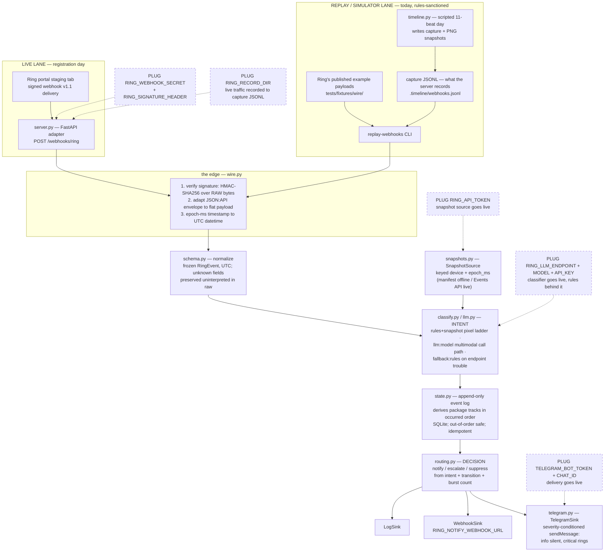

# Architecture — one webhook, five stages, two swappable legs

The canonical diagram for review and submission. The README §Architecture
carries the narrative version; this doc adds what submission day needs:
the **replay/simulator lane** (how the demo runs today, rules-sanctioned)
and the **registration-day plug-in points** (every place live traffic
plugs in — all of them environment, none of them code).

Everything below is verifiable in the repo: module names are files under
`src/ring_assistant/`, behavior is pinned by the 354-test offline suite,
and every latency claim traces to `uv run star-metric` output.

## The flow

Two lanes converge on ONE edge — `Pipeline.handle_v1_1` — so the
simulator demo and a live Ring delivery cannot drift apart downstream.



The same flow as compact ASCII (paste-safe everywhere — Devpost
description, slides, PR bodies):

```
        LIVE LANE (registration day)      SIMULATOR / REPLAY LANE (today)
  Ring staging ── tunnel ── server.py     docs fixtures · capture JSONL · timeline.py
        └──────────────┬────────────────────────────┴──────────────┘
                       ▼            ONE EDGE
        wire.py    HMAC over raw bytes → envelope→flat → epoch-ms→UTC
                       ▼
        schema.py  normalize → frozen RingEvent (UTC, unknown fields kept)
                       ▼
        classify/llm.py  INTENT  ◀── snapshots.py (manifest offline · API live)
                       ▼              (mock vision transport offline · endpoint live)
        state.py   package tracks, SQLite, derived in occurred order
                       ▼
        routing.py DECISION: notify / escalate / suppress
                       ▼
        sinks: Log · Webhook · Telegram (info silent, critical rings)
```

## Stage by stage

| # | Stage | Module | Input → output | Failure behavior |
|---|---|---|---|---|
| 0 | edge | `wire.py` (+ `ingest.py`, `verify.py`) | raw signed v1.1 bytes → `RingEvent` | bad signature → 401; unusable JSON/schema → 400; the 8 documented non-intent event types → ack 200 + ignore (a 4xx would read as permanent failure to Ring) |
| 1 | normalize | `schema.py` | flat payload → frozen UTC `RingEvent` | unknown fields preserved in `raw`, never interpreted |
| 2 | classify | `classify.py`, `llm.py`, `snapshots.py` | `RingEvent` + context (night? open tracks?) → `Intent` | missing/undecodable snapshot → platform-fields verdict; LLM trouble → `fallback:rules` verdict, source visible |
| 3 | state | `state.py` | event → transition + tracks (SQLite) | out-of-order arrival re-derived in occurred order; duplicate id is a no-op |
| 4 | routing | `routing.py` | intent + transition + burst count → decision | deterministic rules table (README §Routing rules) |
| 5 | deliver | `routing.py` sinks, `telegram.py` | decision → notifications | Telegram non-ok answer raises — a notification nobody saw must not look like success |

## The two mocked legs (and their live swaps)

Both network legs run today through deterministic offline stand-ins at
the **transport boundary** — request assembly, payload shape, and
response parsing all execute; only the socket is absent.

| Leg | Offline today | Live swap (env-only) |
|---|---|---|
| classification | full multimodal call path against `mock_vision_transport` — decodes the attached PNG with the same decoder and pixel ladder as the rules path, so verdicts match | `RING_LLM_ENDPOINT` + `RING_LLM_MODEL` (+ `RING_LLM_API_KEY`) — any OpenAI-compatible `/chat/completions` endpoint; `FallbackClassifier` keeps rules behind it |
| delivery | real Telegram sink over a recording transport — formatting, `disable_notification` severity conditioning, `{"ok": true}` parse all run | `TELEGRAM_BOT_TOKEN` + `TELEGRAM_CHAT_ID` — real Bot API POSTs |

## Registration-day plug-in points (marked PLUG above)

1. `RING_WEBHOOK_SECRET` + `RING_SIGNATURE_HEADER=x-signature` → live
   deliveries verify at the edge (scheme already byte-identical).
2. `RING_RECORD_DIR` on the server → live traffic lands in the same
   JSONL capture the replay lane consumes.
3. `RING_API_TOKEN` → `ApiSnapshotSource` replaces the manifest (one
   composition change; real snapshots are JPEG → the LLM leg takes over
   from the pixel rules automatically).
4. `RING_LLM_*` → every entry classifies via the real endpoint.
5. `TELEGRAM_BOT_TOKEN` + `TELEGRAM_CHAT_ID` → routed notifications
   reach a real phone.

Still to build (S2 residue): the OAuth token exchange that *mints*
`RING_API_TOKEN` from `RING_CLIENT_ID`/`RING_CLIENT_SECRET`, and the
account-link stub going real.

## What the star metric measures

`uv run star-metric` wraps each stage of the same 11-delivery day with
`perf_counter` (`StageTimings` on every `TimelineEntry`): `edge`
(verify + adapt + normalize), `classify` (snapshot fetch + verdict),
`state`, `route`, `deliver` — and their sum is the published number,
**ding → routed notification**. Offline runs measure the pipeline's own
work only; live network RTT (LLM, Bot API) is excluded and labeled as
such everywhere a number appears.
